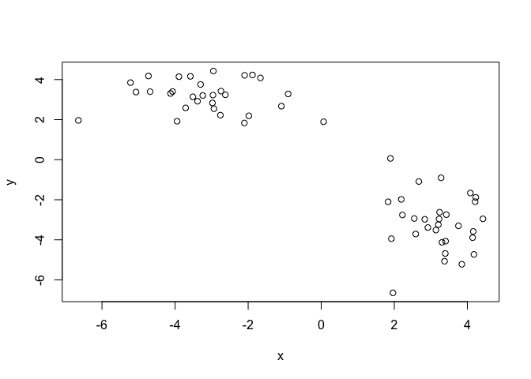
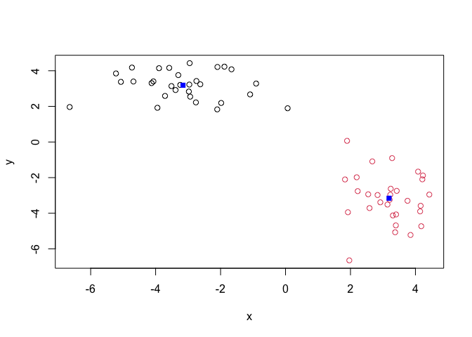
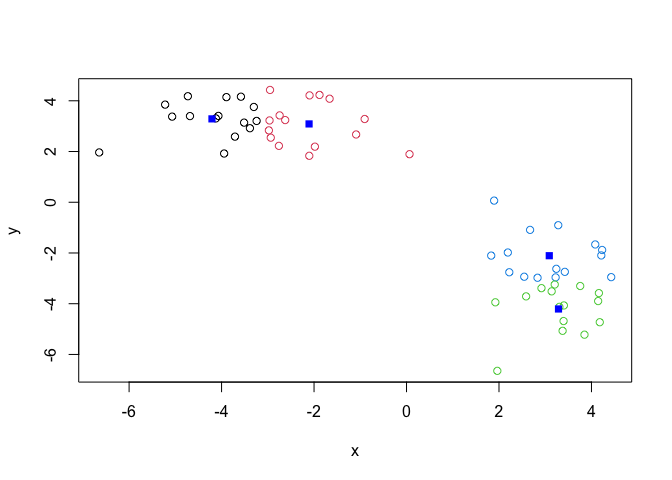
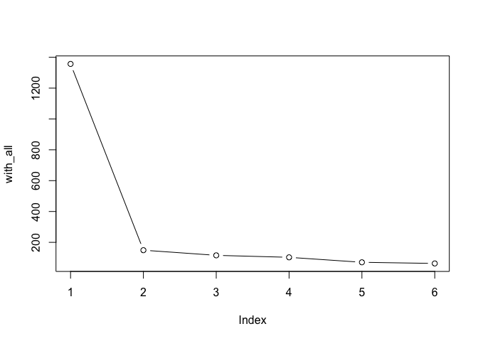
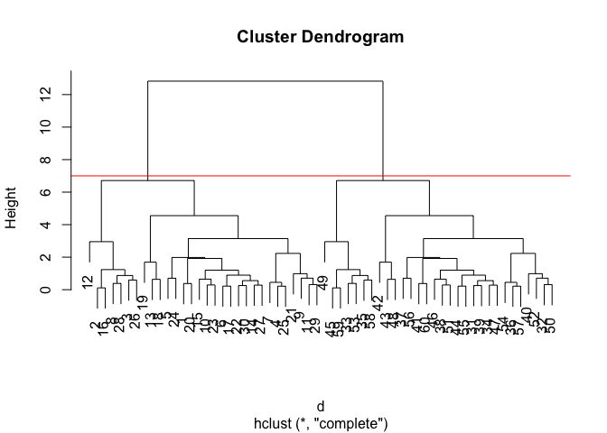
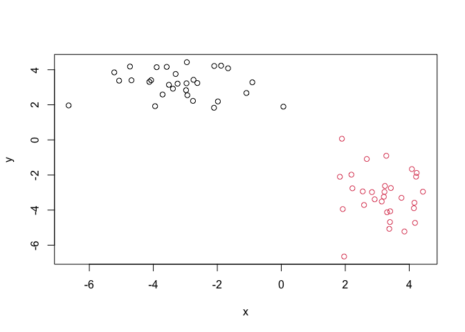
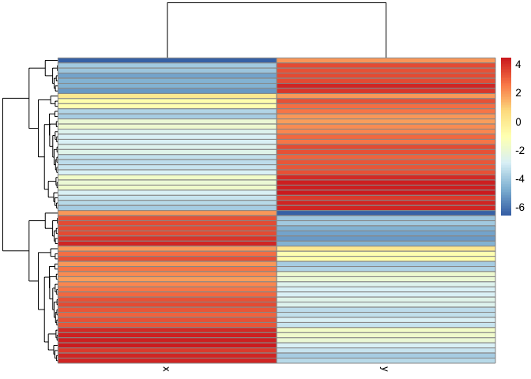

# Class 7: Machine Learning 1
Minjun Kang (PID: A69042800)

Today we will begin our exploration of some “classical” machine learning
approaches. We will start with clustering:

## Sample data generation

Let’s first make up some data to cluster where we know what the answer
should be.

``` r
x <- c(rnorm(30, mean=-3), rnorm(30, mean = 3))
y <- rev(x)

x <- cbind(x, y)
head(x)
```

                 x        y
    [1,] -2.103204 1.831460
    [2,] -4.068382 3.403485
    [3,] -4.728904 4.179831
    [4,] -2.096957 4.212612
    [5,] -3.710508 2.586292
    [6,] -2.744462 3.424038

A wee peak at x with `plot()`

``` r
plot(x)
```



## K-means clustering

Then, main function in “base” R for K-means clustering is called
`kmeans()`.

``` r
k <- kmeans(x, centers = 2)
```

> Q. How big are the clusters?

``` r
k$size
```

    [1] 30 30

> Q. What clusters do my data points reside in?

``` r
k$cluster
```

     [1] 1 1 1 1 1 1 1 1 1 1 1 1 1 1 1 1 1 1 1 1 1 1 1 1 1 1 1 1 1 1 2 2 2 2 2 2 2 2
    [39] 2 2 2 2 2 2 2 2 2 2 2 2 2 2 2 2 2 2 2 2 2 2

> Q. Make a plot of our data colored by cluster assignment - i.e. Make a
> result figure

``` r
plot(x, col = k$cluster) +
points(k$centers, col="blue", pch=15)
```



    integer(0)

> Q. Cluster with k-means into 4 clusters and plot your results as
> above.

``` r
k2 <- kmeans(x, centers = 4)
plot(x, col = k2$cluster)
points(k2$centers, col="blue", pch=15)
```



> Q. Run k-means with center (i.e., values of k) equal 1 to 6

``` r
k_all <- 1:6
with_all <- rep(0, length(k_all))

for (k in k_all) {
  km <- kmeans(x, centers = k)
  with_all[k] <- km$tot.withinss
}

plot(with_all, typ="b")
```



## Hierarchical clustering

The main function in “base” R for this is called `hclust()`

``` r
d <- dist(x)
hc <- hclust(d)
hc
```


    Call:
    hclust(d = d)

    Cluster method   : complete 
    Distance         : euclidean 
    Number of objects: 60 

``` r
plot(hc)
abline(h = 7, col = "red")
```



To obtain clusters from our `hiclust` result object **hc** we “cut” the
tree to yield different sub branches. For this we use the `cutree()`
function

``` r
grps <- cutree(hc, h=7)
grps
```

     [1] 1 1 1 1 1 1 1 1 1 1 1 1 1 1 1 1 1 1 1 1 1 1 1 1 1 1 1 1 1 1 2 2 2 2 2 2 2 2
    [39] 2 2 2 2 2 2 2 2 2 2 2 2 2 2 2 2 2 2 2 2 2 2

``` r
plot(x, col = grps)
```



``` r
library(pheatmap)
pheatmap(x)
```



## Principal Component Analysis (PCA)

``` r
url <- "https://tinyurl.com/UK-foods"
x <- read.csv(url, row.names=1)
head(x)
```

                   England Wales Scotland N.Ireland
    Cheese             105   103      103        66
    Carcass_meat       245   227      242       267
    Other_meat         685   803      750       586
    Fish               147   160      122        93
    Fats_and_oils      193   235      184       209
    Sugars             156   175      147       139

> Q1. How many rows and columns are in your new data frame named x? What
> R functions could you use to answer this questions?

``` r
dim(x)
```

    [1] 17  4

> Q2. Which approach to solving the ‘row-names problem’ mentioned above
> do you prefer and why? Is one approach more robust than another under
> certain circumstances?

The second method (using `read.csv(url, row.names=1)`) would be more
robust since if we accidently apply multiple times for the `x <- x[,-1]`
code in the first method, it would delete the important row.

> Q3: Changing what optional argument in the above barplot() function
> results in the following plot?

``` r
barplot(as.matrix(x), beside=F, col=rainbow(nrow(x)))
```


> Q4: Changing what optional argument in the above ggplot() code results
> in a stacked barplot figure?

``` r
# Create grouped bar plot
library(ggplot2)
```

    Warning: package 'ggplot2' was built under R version 4.5.2

``` r
library(tidyr)

# Convert data to long format for ggplot with `pivot_longer()`
x_long <- x |> 
          tibble::rownames_to_column("Food") |> 
          pivot_longer(cols = -Food, 
                       names_to = "Country", 
                       values_to = "Consumption")
ggplot(x_long) +
  aes(x = Country, y = Consumption, fill = Food) +
  geom_col(position = "stack") +
  theme_bw()
```


> Q5: We can use the pairs() function to generate all pairwise plots for
> our countries. Can you make sense of the following code and resulting
> figure? What does it mean if a given point lies on the diagonal for a
> given plot?

Scatterplot matrices can be useful for relatively small datasets like
this one. Let’s have a look (below). It’s basically generating all
pairwise scatter plots between each country If points lie on the
diagonal, it means two countries have similar features (food
consumption).

``` r
pairs(x, col=rainbow(nrow(x)), pch=16)
```


``` r
pheatmap(as.matrix(x))
```


> Q6. Based on the pairs and heatmap figures, which countries cluster
> together and what does this suggest about their food consumption
> patterns? Can you easily tell what the main differences between N.
> Ireland and the other countries of the UK in terms of this data-set?

Wales, England look quite similar in their consumption of these foods.
However, it remains difficult to see how N.Ireland would be different
from the other countries due to the high dimensionality.

## PCA to the rescue

The main function in “base” R for PCA is called `prcomp()`.

As we want to do PCA on the food data for the different countries we
will want the foods in the columns.

``` r
pca <- prcomp(t(x))
summary(pca)
```

    Importance of components:
                                PC1      PC2      PC3       PC4
    Standard deviation     324.1502 212.7478 73.87622 2.921e-14
    Proportion of Variance   0.6744   0.2905  0.03503 0.000e+00
    Cumulative Proportion    0.6744   0.9650  1.00000 1.000e+00

``` r
pca$x
```

                     PC1         PC2        PC3           PC4
    England   -144.99315   -2.532999 105.768945 -9.152022e-15
    Wales     -240.52915 -224.646925 -56.475555  5.560040e-13
    Scotland   -91.86934  286.081786 -44.415495 -6.638419e-13
    N.Ireland  477.39164  -58.901862  -4.877895  1.329771e-13

> Q7. Complete the code below to generate a plot of PC1 vs PC2. The
> second line adds text labels over the data points. Q8. Customize your
> plot so that the colors of the country names match the colors in our
> UK and Ireland map and table at start of this document.

``` r
library(ggplot2)

cols <- c("orange", "red", "blue", "darkgreen")

# Create a data frame for plotting
df <- as.data.frame(pca$x)
df$Country <- rownames(df)

# Plot PC1 vs PC2 with ggplot
ggplot(pca$x) +
  aes(x = PC1, y = PC2, label = rownames(pca$x)) +
  geom_point(size = 3) +
  geom_text(vjust = -0.5, col = cols) +
  xlim(-270, 500) +
  xlab("PC1") +
  ylab("PC2") +
  theme_bw()
```


> Q9: Generate a similar ‘loadings plot’ for PC2. What two food groups
> feature prominantely and what does PC2 maninly tell us about?

Another major result out of PCA is the so-called “variable loadings” or
`$rotation` that tells us how the original variables contribute to the
new axis. The reuslts show that Soft_drinks have a large and positive
contribute to the PC2, and Fresh_potatoes have a large yet negative
contribution to the PC2.

``` r
ggplot(pca$rotation) +
  aes(PC2, rownames(pca$rotation)) +
  geom_col()
```


