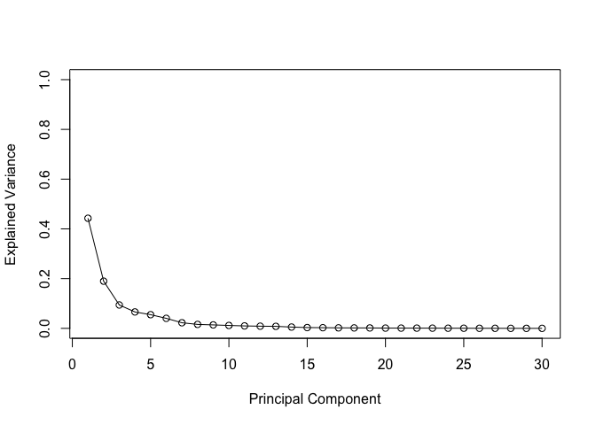

# Class 08: Breast Cancer Mini Project
Minjun Kang (PID: A69042800)

- [Background](#background)
- [Data import](#data-import)
- [Principal Component Analysis
  (PCA)](#principal-component-analysis-pca)
- [Interpreting PCA results](#interpreting-pca-results)
- [Hierarchical Clustering](#hierarchical-clustering)
- [Combining PCA + Hierarchical
  Clustering](#combining-pca--hierarchical-clustering)

## Background

The goal of this mini-project is for you to explore a complete analysis
using the unsupervised learning techniques covered in class. We’ll
extend what we learned by combining PCA as a preprocessing step to
clustering using data that consist of measurements of cell nuclei of
human breast masses. This expands on our RNA-Seq analysis from last day.

The data itself comes from the Wisconsin Breast Cancer Diagnostic Data
Set first reported by K. P. Benne and O. L. Mangasarian: “Robust Linear
Programming Discrimination of Two Linearly Inseparable Sets”.

Values in this data set describe characteristics of the cell nuclei
present in digitized images of a fine needle aspiration (FNA) of a
breast mass.

## Data import

The data is available as a CSV from the class website:

``` r
# Import data
fna.data <- "WisconsinCancer.csv"
wisc.df <- read.csv(fna.data, row.names=1)
```

Make sure we do not include patient (sample) ID for the further
analysis.

``` r
diagnosis <- as.factor(wisc.df$diagnosis)
wisc.data <- wisc.df[, -1]
wisc.data <- subset(wisc.data, select = -X)
```

> Q1. How many observations are in this dataset?

There are 569 observations in this dataset.

> Q2. How many of the observations have a malignant diagnosis?

There are 212 observations.

> Q3. How many variables/features in the data are suffixed with \_mean?

There are 10 variables with \_mean.

## Principal Component Analysis (PCA)

The main function in base R for PCA is called `prcomp()`. A optional
argument `scale` should nearly always be switched to `scale=TRUE` for
this function.

``` r
wisc.pr <- prcomp(wisc.data, scale=TRUE)
```

Let’s make our main result figure - the “PC plot”or “score plot”,
“ordienation plot” …

``` r
library(ggplot2)
```

    Warning: package 'ggplot2' was built under R version 4.5.2

``` r
ggplot(wisc.pr$x, aes(PC1, PC2, col=diagnosis)) +
  geom_point()
```


> Q4. From your results, what proportion of the original variance is
> captured by the first principal components (PC1)?

Explained variance is 44.2720256%.

``` r
pve <- wisc.pr$sdev^2 / sum(wisc.pr$sdev^2)

# Plot variance explained for each principal component
plot(pve, xlab = "Principal Component", 
     ylab = "Explained Variance", 
     ylim = c(0, 1), type = "o")
```



> Q5. How many principal components (PCs) are required to describe at
> least 70% of the original variance in the data?

3 PCs are required to describe at least 70% of the original variance.

> Q6. How many principal components (PCs) are required to describe at
> least 90% of the original variance in the data?

7 PCs are required to describe at least 90% of the original variance.

## Interpreting PCA results

``` r
biplot(wisc.pr)
```


> Q7. What stands out to you about this plot? Is it easy or difficult to
> understand? Why?

Rownames are used to label each dots in the plot, which makes us hard to
understand.

> Q8. Generate a similar plot for principal components 1 and 3. What do
> you notice about these plots?

``` r
library(ggplot2)

ggplot(wisc.pr$x, aes(PC1, PC3, col=diagnosis)) +
  geom_point() +
  labs(x="PC1", y="PC3")
```


> Q9. For the first principal component, what is the component of the
> loading vector (i.e. wisc.pr\$rotation\[,1\]) for the feature
> concave.points_mean? This tells us how much this original feature
> contributes to the first PC.

It is -0.26. We can use `wisc.pr$rotation[, 1]['concave.points_mean']`.

## Hierarchical Clustering

``` r
data.scaled <- scale(wisc.data)
data.dist <- dist(data.scaled)
wisc.hclust <- hclust(data.dist, method="complete")
```

> Q10. Using the plot() and abline() functions, what is the height at
> which the clustering model has 4 clusters?

The height is 19.5.

``` r
plot(wisc.hclust)
abline(h = 19.5, col="red", lty=2)
```


``` r
grps1 <- cutree(wisc.hclust, k = 4)
table(grps1, diagnosis)
```

         diagnosis
    grps1   B   M
        1  12 165
        2   2   5
        3 343  40
        4   0   2

## Combining PCA + Hierarchical Clustering

``` r
d <- dist(wisc.pr$x[, 1:3])
wisc.pr.hclust <- hclust(d, method = "ward.D2")
plot(wisc.pr.hclust)
```


``` r
grps2 <- cutree(wisc.pr.hclust, k = 2)
```

Make a wee “cross-table”

``` r
table(grps2, diagnosis)
```

         diagnosis
    grps2   B   M
        1  24 179
        2 333  33

TP: 179 FP: 24

Sensitivity: TP / (TP+FN)

> Q14. How well do the hierarchical clustering models you created in
> previous sections (i.e. before PCA) do in terms of separating the
> diagnoses? Again, use the table() function to compare the output of
> each model (wisc.km\$cluster and wisc.hclust.clusters) with the vector
> containing the actual diagnoses.

PCA shows the better classification performance since it makes data to
be normalized, scaled, and the variables to be uncorrelated with each
other.

``` r
print("Previous (raw data) version")
```

    [1] "Previous (raw data) version"

``` r
table(grps1, diagnosis)
```

         diagnosis
    grps1   B   M
        1  12 165
        2   2   5
        3 343  40
        4   0   2

``` r
print("Current (pca data) version")
```

    [1] "Current (pca data) version"

``` r
table(grps2, diagnosis)
```

         diagnosis
    grps2   B   M
        1  24 179
        2 333  33
